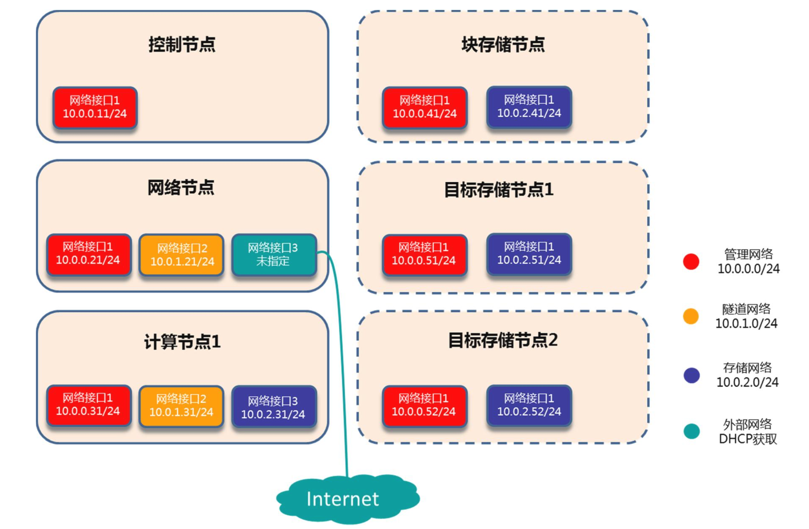
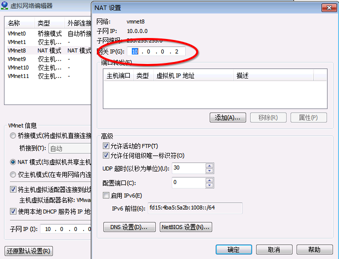
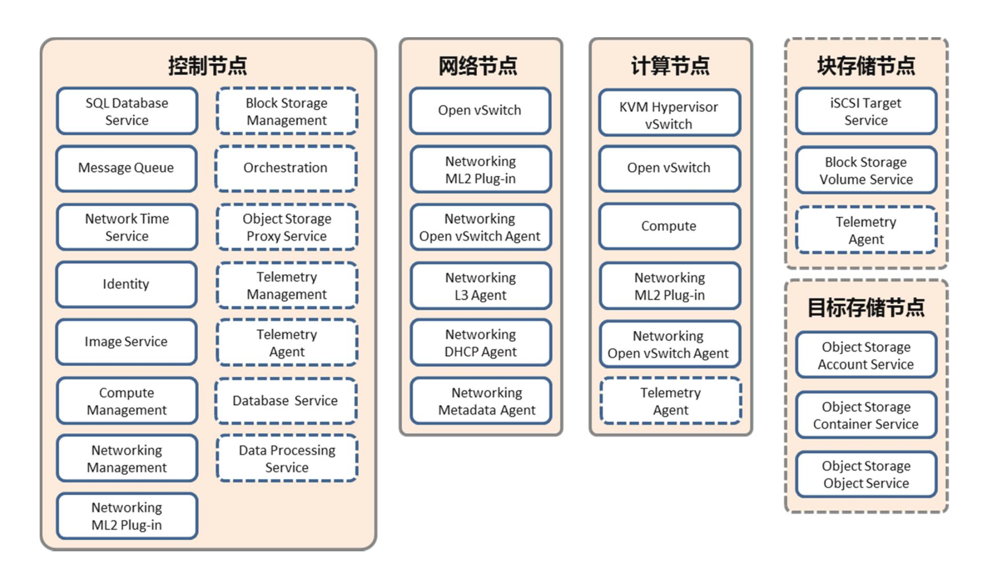

#简介

本章节包含三大部分，详细介绍了在虚拟化环境上搭建openstack的步骤

**openstack controller 节点搭建**

**openstack computer 节点搭建**

**openstack network 节点搭建**

本文介绍搭建openstack前的一些准备工作，包括相关配置说明、虚拟机安装注意事项、密码说明等

##环境

本实践采用的环境为VMware Workstation + CentOS + OpenStack

[VMware Workstation]():  12.5.2, build-4638234

[CentOS](): CentOS-7-x86_64-DVD-1511.iso, kernel-3.10.0-327.el7

[Openstack](): OpenStack Newton, the 14th release, October 6 2016

##相关配置说明

实践环境采用最基本配置安装部署，1+1+1，即一个管理节点、一个网络节点和一个计算节点。

虚拟机的配置如下：

**控制节点**： 2U(1cpu2核心) 2G内存 20G硬盘

**网络节点**： 2U(1cpu2核心) 2G内存 20G硬盘

**计算节点**： 2U(1cpu2核心) 4G内存 40G硬盘

拓扑结构如图所示：



为使各网络之间相互不干扰且虚拟机可连接外网更新或者安装软件，虚拟网络划分为至少5个网段


本实践会使用VMnet0、VMnet8、VMnet9、VMnet10、VMnet11 5个虚拟网络

其中**VMnet0**为与宿主机通信的网络，默认使用，其他四个虚拟网络为openstack环境使用

**注**：

VMnet8虚拟网络中，NAT的网关IP需要设置成[10.0.0.2]()，因为在虚拟机环境当中，10.0.0.1的IP地址已经被宿主机使用。




三台虚拟机详细地址规划如下：

<table class="table table-bordered table-striped table-condensed">  
    <tr>  
    	<td style="font-weight:bold">节点</td>  
    	<td>Controller Node</td>
    	<td>Network Node</td>
    	<td>Computer1 Node</td>
    </tr>  
    <tr>  
    	<td style="font-weight:bold">名称</td>  
    	<td>controller</td>
    	<td>network</td>
    	<td>computer1</td>
    </tr>
    <tr>  
    	<td style="font-weight:bold">管理网络接口</td>  
    	<td>10.0.0.11/24</td>
    	<td>10.0.0.21/24</td>
    	<td>10.0.0.31/24</td>
    </tr>
    <tr>  
    	<td style="font-weight:bold">隧道网络接口</td>  
    	<td></td>
    	<td>10.0.1.21/24</td>
    	<td>10.0.1.31/24</td>
    </tr>
    <tr>  
    	<td style="font-weight:bold">存储网络接口</td>  
    	<td></td>
    	<td></td>
    	<td>10.0.2.31/24</td>
    </tr>
    <tr>  
    	<td style="font-weight:bold">外部网络接口</td>  
    	<td></td>
    	<td>DHCP或指定</td>
    	<td></td>
    </tr>
</table>  

## VM 安装注意事项
###1. CentOS 安装选择
虚拟机安装使用最小化安(后期需要手动安装缺失的软件包)或者computer node模式即可，CPU VT-x功能开启后，VMware安装虚拟机会默认自动选择模式
	
###2. CPU 虚拟化功能开启
本实践使用VMware安装虚拟机模拟真实物理机环境，因此需要将虚拟机CPU的虚拟化功能开启
	

	
###3. 虚拟机安装完成后请修改时区为CST
	
```
cp /usr/share/zoneinfo/Asia/Shanghai /etc/localtime
```

###4. 修改VIM设置

修改```/etc/vimrc```文件

```
#新增
set ts=4
set expandtab
```

##模块安装明细

部分模块在三个节点上都要安装，例如neutron

## Passwords

安装过程中会有非常多的密码设定，此处记录本实践所用到的密码

Password name | Description |    *MY*
------------- | ----------- | ----------
Database password (no variable used)|Root password for the database|*openstack*
RABBIT_PASS|Password of user guest of RabbitMQ|*rabbit*
KEYSTONE_DBPASS|Database password of Identity service|*keystone*
DEMO_PASS|Password of user demo|*demo*
ADMIN_PASS|Password of user admin|*admin*
GLANCE_DBPASS|Database password for Image Service|*glance*
GLANCE_PASS|Password of Image Service user glance|*glancer*
NOVA_DBPASS|Database password for Compute service|*nova*
NOVA_PASS|Password of Compute service user nova|*nova*
DASH_DBPASS|Database password for the dashboard|*dash*
CINDER_DBPASS|Database password for the Block Storage service|*cinder*
CINDER_PASS|Password of Block Storage service user cinder|*cinder*
NEUTRON_DBPASS|Database password for the Networking service|*neutron*
NEUTRON_PASS|Password of Networking service user neutron|*neutron*
HEAT_DBPASS|Database password for the Orchestration service|*heat*
HEAT_PASS|Password of Orchestration service user heat|*heat*
CEILOMETER_DBPASS|Database password for the Telemetry service|*ceilometer*
CEILOMETER_PASS|Password of Telemetry service user ceilometer|*ceilometer*
TROVE_DBPASS|Database password of Database service|*trove*
TROVE_PASS|Password of Database Service user trove|*trove*


##参考文档

* [OpenStack Installation Tutorial for Red Hat Enterprise Linux and CentOS](http://docs.openstack.org/newton/install-guide-rdo/index.html)

